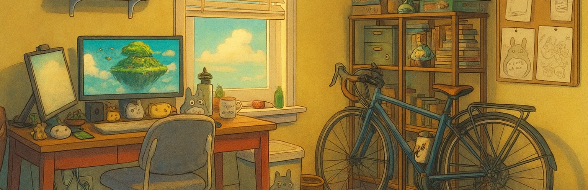

# Hi there! 

### AI Engineer | Full Stack Developer | Mechatronics Engineer

Welcome to my GitHub profile! I'm a multidisciplinary developer with a passion for building innovative products that combine technical depth with creativity. With a background in AI engineering, full-stack web development, and mechatronics, I enjoy working on projects that push the boundaries of technology and user experience.

---

### ✨ **Featured Project — [Charmed](https://github.com/joeyvigil/charmed-dating)**

**A free, no-swipe dating app — search for people by what matters to you and message anyone.** A React web app and a React Native mobile app share one **FastAPI** backend and a single real-time WebSocket, running in production on a **$0 cloud stack**.

🔗 **[Live demo](https://charmed.lol)** &nbsp;·&nbsp; **[Source](https://github.com/joeyvigil/charmed-dating)** &nbsp;·&nbsp; FastAPI · React · React Native · Postgres · WebSockets · 122 tests

---

### 🚀 **About Me**

- **Multidisciplinary Developer**: Software developer and engineer with a background in **AI engineering**, **full-stack web development**, and **mechatronics**
- **Experience**: Building modern web applications, developing AI-powered tools, deploying cloud infrastructure, and creating interactive user experiences
- **Tech Expertise**: Python, FastAPI, React, TypeScript, Docker, GCP, AWS, PostgreSQL, and modern frontend frameworks
- **AI Focus**: Recently focused heavily on generative AI applications using **LangChain**, **LangGraph**, **Ollama**, **Vector Databases**, and **Vertex AI**
- **Engineering Background**: **Master's degree in Mechatronics Engineering** with experience in robotics, embedded systems, CAD design, and material research
- **Products**: Building products that combine technical depth with creativity, including AI tools, web platforms, and board game projects through **Squeak Inc. Games**

### 🛠️ **Tech Stack & Specialties**

