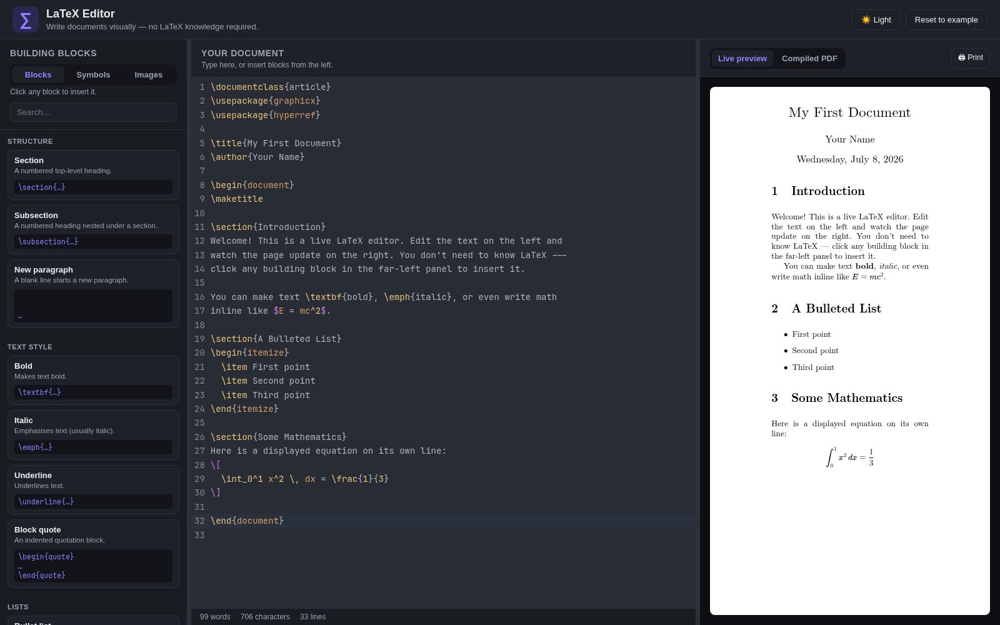
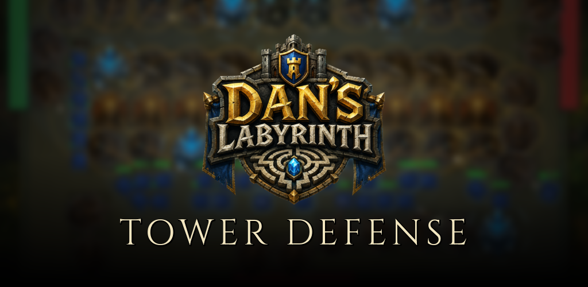
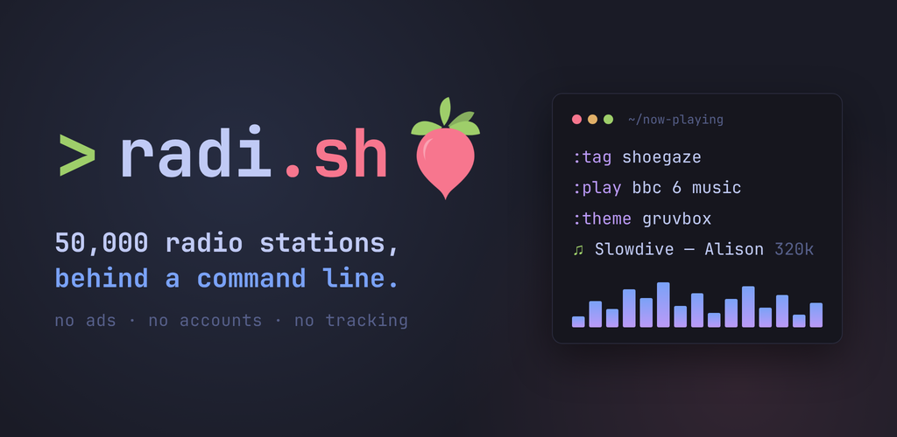

# Hi there! 

### AI Engineer | Full Stack Developer | Mechatronics Engineer

I'm a developer with a Master's in Mechatronics Engineering who likes to **ship things that actually run in production** — full-stack web, mobile, AI-powered tools, and the occasional piece of hardware. I work terminal-first and AI-paired (Arch/Omarchy + Claude Code on the CLI), which keeps more of the work on architecture and judgment.

### 🖥️ **[joeyvigil.github.io](https://joeyvigil.github.io)** — my portfolio

A developer portfolio that reads like a terminal session on an Arch box — Waybar status bar, tiled windows, nine themes, and a **real shell** you can type into (press <kbd>`</kbd>).

Built from scratch, no UI library, no tracking. **[Source](https://github.com/joeyvigil/joeyvigil.github.io)** &nbsp;·&nbsp; React 19 · TypeScript · Vite · Tailwind v4

---

### 🧰 **Projects**

<table>
<tr>
<td width="50%" valign="top">

#### 💘 [Charmed](https://github.com/joeyvigil/charmed-dating)

**A free, no-swipe dating app** — search for people by what matters to you and message anyone. A React web app and a React Native mobile app share one **FastAPI** backend and a single real-time WebSocket, running in production on a **$0 cloud stack**.

**[Live demo](https://charmed.lol)** &nbsp;·&nbsp; **[Source](https://github.com/joeyvigil/charmed-dating)** &nbsp;·&nbsp; FastAPI · React · React Native · Postgres · WebSockets · 122 tests

</td>
<td width="50%" valign="top">

#### 📝 [LaTeX Editor](https://joeyvigil.github.io/latex-editor/)

A beginner-friendly, **in-browser LaTeX editor** for people who don't know LaTeX — a clickable palette of building blocks, live preview, and a real **pdfLaTeX** compile that runs entirely in your browser via WebAssembly. No install, no backend.

**[Live demo](https://joeyvigil.github.io/latex-editor/)** &nbsp;·&nbsp; **[Source](https://github.com/joeyvigil/latex-editor)** &nbsp;·&nbsp; React · TS · Vite · WASM

</td>
</tr>
<tr>
<td width="50%" valign="top">

#### 🏰 [Dan's Labyrinth — Tower Defense](https://play.google.com/store/apps/details?id=com.joeyvigil.danslabyrinth)

A **maze / tower-defense mobile game** built in **Godot 4.6** — your towers act as walls and enemies pathfind through the gaps. A 20-level hand-authored campaign, 10 distinct towers, infinite escalating waves, boss rounds, and a global leaderboard. **Live on Google Play.**

**[Get it on Google Play](https://play.google.com/store/apps/details?id=com.joeyvigil.danslabyrinth)** &nbsp;·&nbsp; Godot 4.6 · Android · Closed-source

</td>
<td width="50%" valign="top">

#### 🤖 [joey-bot](https://github.com/joeyvigil/discord-bot)

A **Discord bot** built with discord.py using slash commands — games, live button polls, trivia, tic-tac-toe, and API-powered toys. Dockerized and deployed on **Fly.io**.

**[Invite it](https://discord.com/oauth2/authorize?client_id=1516042370439839784)** &nbsp;·&nbsp; **[Source](https://github.com/joeyvigil/discord-bot)** &nbsp;·&nbsp; Python · discord.py · Docker · Fly.io

</td>
</tr>
<tr>
<td width="50%" valign="top">

#### 🧬 [sql-to-rest](https://joeyvigil.github.io/sql-to-rest/)

Paste SQL `CREATE TABLE` statements and get back a **runnable FastAPI app** — SQLAlchemy models, Pydantic schemas, and per-table CRUD routers (optional Docker + pytest), downloadable as a `.zip`.

**[Live demo](https://joeyvigil.github.io/sql-to-rest/)** &nbsp;·&nbsp; **[Source](https://github.com/joeyvigil/sql-to-rest)** &nbsp;·&nbsp; React · TS · FastAPI codegen

</td>
<td width="50%" valign="top">

#### 📻 radi.sh — Terminal Internet Radio

A **terminal-aesthetic radio player** for Android — ~50,000 stations from the community Radio Browser directory, driven by a vim-style `:` command line. A **real** 512-point FFT spectrum analyser drawn from decoded PCM, now-playing titles read straight off the ICY stream, background playback with lock-screen controls, and 32 colour themes. 13 runtime dependencies — no UI kit, no state library, no nav library.

Android · React Native · Expo SDK 57 · TypeScript · Closed-source

</td>
</tr>
</table>

---

### 🚀 **About Me**

- 🤖 **AI Engineer** — LLM-powered apps and tools with **LangChain**, **LangGraph**, **Ollama**, and vector databases
- 🐍 **Full-stack end to end** — Python/FastAPI back ends, React/React Native front ends, Postgres, Docker, CI, and small deploys on **AWS**
- 📱 **Ships to phones** — React Native and Godot on Android, from release signing through the Play listing
- 🔧 **Master's in Mechatronics Engineering** — robotics, embedded systems, CAD, and 3D printing (see **[k3yb0rg](https://github.com/joeyvigil/k3yb0rg)**)
- 🎲 Building small products through **[Squeak Inc. Games](https://squeakincgames.com/)**

### 🛠️ **Tech Stack**

